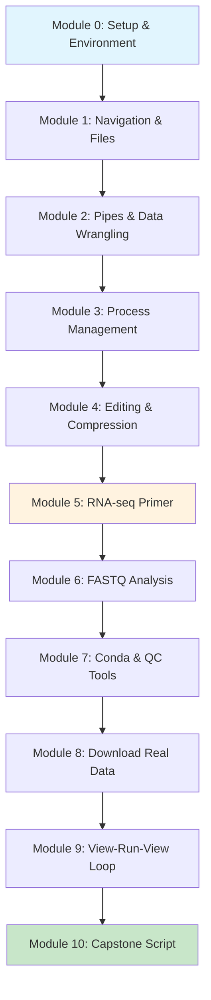

# Digital Embryo — Bioinformatics Command-Line Tutorial

Welcome to the **Digital Embryo** bioinformatics tutorial! This hands-on course will take you from command-line basics to analyzing real RNA-seq data.

## Learning Path

## Course Philosophy

!!! tip "Type it, don't paste it"
    This tutorial emphasizes **muscle memory**. Type commands first, then copy/paste to check your work. Your future self will thank you.

!!! info "Look before you loop"
    Always examine data with `head`, `tail`, `less`, or `zless` before writing scripts that process many files.

!!! note "Help first, experiment second"
    Always run `command --help` (or `man command`) the first time you encounter a new tool. Understanding the options saves time and prevents mistakes.

## What You'll Learn

- **Command-line fundamentals**: navigation, file operations, text processing
- **Data wrangling**: pipes, redirects, grep, awk, and cut
- **Process management**: background jobs, monitoring, and safe termination
- **Bioinformatics tools**: conda environments, FastQC, MultiQC, seqtk
- **Real data analysis**: downloading from SRA/ENA, quality control workflows
- **Scripting**: building robust, reusable analysis scripts

## Prerequisites

- A computer with WSL2 (Windows), Terminal (macOS), or Linux
- VS Code (recommended)
- Willingness to type commands and learn by doing

## Time Commitment

- **Total**: ~8-10 hours
- **Per module**: 30-90 minutes
- **Format**: Self-paced with email exit tickets

## Getting Started

1. Start with [Module 0: Setup & Expectations](modules/00-setup.md)
2. Keep the [Cheat Sheet](cheatsheet.md) handy for quick reference
3. Type commands first, copy/paste second
4. Submit exit tickets as you complete each module

Ready to begin? Let's build those command-line skills! 🧬
