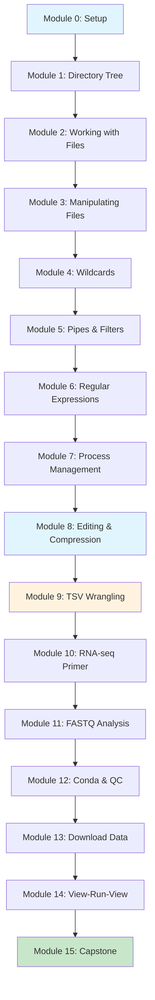

# Digital Embryo — Bioinformatics Command-Line Tutorial

Welcome to the **Digital Embryo** bioinformatics tutorial! This hands-on course will take you from command-line basics to analyzing real RNA-seq data, with **no prior coding knowledge required**.

## Learning Path

## Unix Fundamentals (Modules 0-8)

Build a rock-solid foundation in Unix command-line skills with comprehensive, beginner-friendly modules:

1. **[Module 0: Setup & Understanding Your Environment](modules/00-setup.md)** — Learn what terminals and shells are, understand command structure (command + options + arguments), and set up your workspace.
2. **[Module 1: The Directory Tree & Navigation](modules/01-directory-tree.md)** — Master the Unix filesystem tree, understand absolute vs relative paths, and navigate with pwd, cd, and ls.
3. **[Module 2: Working with Files](modules/02-working-with-files.md)** — Create, view, and inspect files with cat, less, head, tail, and wc. Learn when to use each tool.
4. **[Module 3: Manipulating Files (Safely!)](modules/03-manipulating-files.md)** — Copy, move, rename, and delete files while learning critical safety practices and the "interactive mode" flag.
5. **[Module 4: Wildcards & Pattern Matching](modules/04-wildcards.md)** — Use *, ?, and [...] to work with multiple files efficiently. Essential for batch processing genomic data.
6. **[Module 5: Pipes, Redirects & Filters](modules/05-pipes-filters.md)** — Chain commands together with pipes and master grep, cut, sort, uniq, and wc for data wrangling.
7. **[Module 6: Regular Expressions for Bioinformatics](modules/06-regex.md)** — Learn powerful pattern matching for validating sample IDs, finding sequence motifs, and parsing file formats.
8. **[Module 7: Process Management & Job Control](modules/07-processes.md)** — Monitor programs, rescue frozen terminals, manage background jobs, and handle long-running analyses.
9. **[Module 8: Text Editing & File Compression](modules/08-editing-compression.md)** — Edit files with nano, work with compressed genomic data (gzip), and verify file integrity with checksums.

## Bioinformatics Applications (Modules 9-15)

Apply your Unix skills to real bioinformatics workflows:

10. **[Module 9: Advanced TSV Data Wrangling](modules/02-pipes-tsv.md)** — Chain commands to wrangle tabular sample manifests.
11. **[Module 10: RNA-seq Primer](modules/05-rnaseq-primer.md)** — Preview the RNA-seq workflow and vocabulary.
12. **[Module 11: FASTQ Analysis](modules/06-fastq-101.md)** — Inspect sequencing reads and compute QC statistics.
13. **[Module 12: Conda & QC Tools](modules/07-env-qc.md)** — Build conda environments and run FastQC/MultiQC.
14. **[Module 13: Download Real Data](modules/08-pull-one-srr.md)** — Retrieve sequencing runs from public archives (SRA/ENA).
15. **[Module 14: View-Run-View Loop](modules/09-view-run-view.md)** — Iterate on analysis pipelines with sanity checks.
16. **[Module 15: Capstone Script](modules/10-capstone.md)** — Automate the complete QC workflow end-to-end.

## Course Philosophy

!!! tip "Type it, don't paste it"
    This tutorial emphasizes **muscle memory**. Type commands first, then copy/paste to check your work. Your future self will thank you.

!!! info "Look before you loop"
    Always examine data with `head`, `tail`, `less`, or `zless` before writing scripts that process many files.

!!! note "Help first, experiment second"
    Always run `command --help` (or `man command`) the first time you encounter a new tool. Understanding the options saves time and prevents mistakes.

## What You'll Learn

- **Command-line fundamentals**: navigation, file operations, text processing
- **Data wrangling**: pipes, redirects, grep, awk, and cut
- **Process management**: background jobs, monitoring, and safe termination
- **Bioinformatics tools**: conda environments, FastQC, MultiQC, seqtk
- **Real data analysis**: downloading from SRA/ENA, quality control workflows
- **Scripting**: building robust, reusable analysis scripts

## Prerequisites

- A computer with WSL2 (Windows), Terminal (macOS), or Linux
- VS Code (recommended)
- Willingness to type commands and learn by doing

## Time Commitment

- **Total**: ~8-10 hours
- **Per module**: 30-90 minutes
- **Format**: Self-paced with email exit tickets

## Getting Started

1. Start with [Module 0: Setup & Expectations](modules/00-setup.md)
2. Keep the [Cheat Sheet](cheatsheet.md) handy for quick reference
3. Type commands first, copy/paste second
4. Submit exit tickets as you complete each module

Ready to begin? Let's build those command-line skills! 🧬
