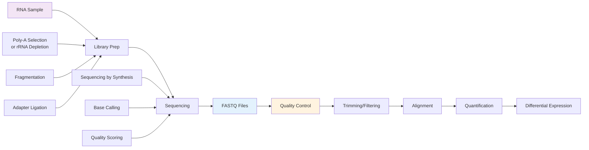

# Module 5 — RNA-seq Primer (Watch/Skim)

**Time:** 30–45 min  
**Goal:** Know the wet-lab → data flow so FASTQ lines make sense.

!!! info "Pick any 2–3 videos (watch at 1.25× if you like)"
    - [Gentle concept video: StatQuest: RNA-seq](https://www.youtube.com/watch?v=tlf6wYJrwKY): Great intro to gene expression analysis by RNA sequencing
    - [Single Cell Sequencing - Eric Chow (UCSF)](https://www.youtube.com/watch?v=k9VFNLLQP8c): This one is mandatory!!
    - [Part I: What is next generation sequencing](https://www.illumina.com/science/technology/next-generation-sequencing.html): This illumina page describes sequencing by synthesis, includes a video
    - [Part II: Intro to RNA-seq analysis](https://www.illumina.com/company/video-hub/XdoAnsDPMfA.html): This is the first of several videos on RNA seq analysis (feel free to browse the others) 
    - [EMBL-EBI "Introduction to RNA-seq & functional interpretation"](https://www.ebi.ac.uk/training/materials/introduction-to-rna-seq-materials/course-content/): Full course materials + recordings to get a minor in RNA seq

!!! tip "Core habit you'll use forever"
    **Look before you loop.** For any new dataset or tool, skim raw inputs and outputs with `head`, `tail`, `less`, or `zless` before writing a script that blasts through many files.

## RNA-seq Workflow Overview

## What to notice while watching

- Where quality scores come from (fluorescence → base call → Phred).
- Why library prep choices (poly-A, rRNA depletion, UMIs) change what you see in FASTQ.
- Paired-end vs single-end expectations (R1/R2 roles).

Optional references for later: [SRA home](https://www.ncbi.nlm.nih.gov/sra) & [Run Selector docs](https://www.ncbi.nlm.nih.gov/sra/docs/). NCBI, NCBI Insights

## Exit Ticket (email)

**Subject:** DE M5 Exit Ticket – <Your Name>  
**Paste:**

Three bullets: (1) what a read's quality string represents, (2) one library-prep choice and its consequence, (3) why we "look before we loop," in your own words.