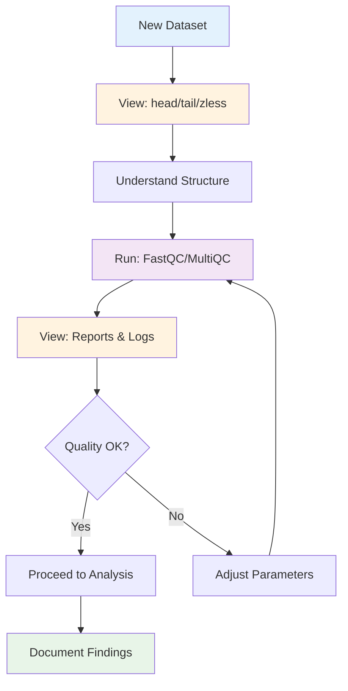

# Module 9 — The "View → Run → View" Loop (on a Real File)

**Time:** 60–75 min  
**Goal:** Practice the core habit on your downloaded FASTQ.

!!! tip "Look before you loop"
    For a new dataset, always skim raw inputs and tool outputs before writing scripts.

## The View → Run → View Workflow



## 1) Inspect the data

=== "Linux/WSL"

    ```bash
    cd ~/de-onramp/lesson5/data
    zcat SRR.fastq.gz | head -n 8
    zcat SRR.fastq.gz | awk 'NR%4==2{r++; bp+=length($0)} END{print "Reads:",r,"Bases:",bp}'
    ```

    If you made `SRR.10k.fastq.gz`, use that for speed:

    ```bash
    zcat SRR.10k.fastq.gz | head -n 8
    ```

=== "macOS"

    ```bash
    cd ~/de-onramp/lesson5/data
    gzcat SRR.fastq.gz | head -n 8
    gzcat SRR.fastq.gz | awk 'NR%4==2{r++; bp+=length($0)} END{print "Reads:",r,"Bases:",bp}'
    ```

    If you made `SRR.10k.fastq.gz`, use that for speed:

    ```bash
    gzcat SRR.10k.fastq.gz | head -n 8
    ```

## 2) Run FastQC + MultiQC

```bash
mkdir -p ../qc && cd ../qc
fastqc ../data/SRR*.fastq.gz
multiqc .
```

Open `multiqc_report.html`. Note:

- Per-base quality profile
- GC distribution
- Overrepresented sequences / adapter content
- Sequence length distribution

## 3) Jot a mini-QC

Create `../qc/notes.txt` with 4–5 bullets answering:

- Is quality high and uniform across cycles?
- Any adapters/overrepresented sequences?
- Paired vs single-end expectations met?
- What would you do next (trim? filter? align?)

## Exit Ticket (email)

**Subject:** DE M9 Exit Ticket – <Your Name>  
**Paste:**

- 5 bullets from your `notes.txt`
- One MultiQC screenshot (per-base quality or GC)