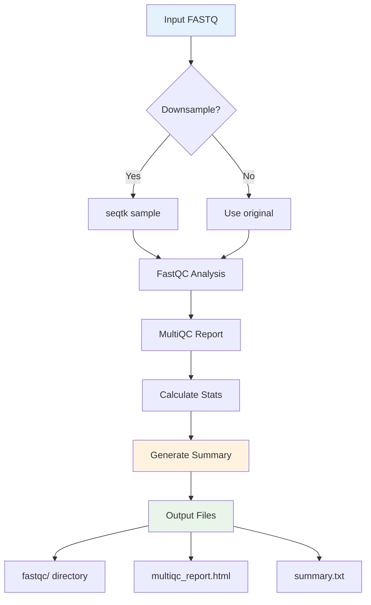

# Module 10 — Capstone: One-Command QC Script

**Time:** 60–90 min  
**Goal:** Write a robust script that down-samples (optional), runs fastqc and multiqc, and writes a text summary.

!!! note "What you'll submit"
    - Your script `run_qc.sh`
    - The `.out` summary it produces
    - 4–5 sentence reflection (what surprised you, one improvement)

## 1) Directory prep

```bash
mkdir -p ~/de-onramp/capstone/{data,results,logs}
cp ~/de-onramp/lesson5/data/SRR*.fastq.gz ~/de-onramp/capstone/data/
cd ~/de-onramp/capstone
conda activate rnaseq101
```

## 2) Script workflow overview



## 3) Script skeleton (start here, then extend)

Create `run_qc.sh`:

```bash
#!/usr/bin/env bash
set -euo pipefail

usage() {
  echo "Usage: $0 -i <in.fastq(.gz)> [-o <outdir>] [-p <fraction>]"
  echo "  -p fraction: optional downsample fraction (0< p <=1), default: 1.0"
  exit 1
}

IN=""; OUT="results"; P=1.0
while getopts ":i:o:p:" opt; do
  case $opt in
    i) IN="$OPTARG";;
    o) OUT="$OPTARG";;
    p) P="$OPTARG";;
    *) usage;;
  esac
done
[[ -z "${IN}" ]] && usage

mkdir -p "$OUT"/{fastqc,logs}
BASENAME=$(basename "$IN" .gz); BASENAME=${BASENAME%.fastq}
WORK="$OUT/${BASENAME}"

# Downsample (if P<1) to a temp file
TMP="${WORK}.tmp.fastq.gz"
if awk "BEGIN{exit !($P < 1.0)}"; then
  seqtk sample -s 1 "$IN" "$P" | gzip > "$TMP"
else
  ln -sf "$(realpath "$IN")" "$TMP"
fi

# Run FastQC
fastqc -o "$OUT/fastqc" "$TMP"

# Aggregate
multiqc -o "$OUT" "$OUT/fastqc" > "$OUT/logs/multiqc.log" 2>&1 || true

# Summaries: reads, bases, GC (rough), file size
# Use gzcat for macOS compatibility
READS=$(( (uname -s | grep -q Darwin) && gzcat "$TMP" || zcat "$TMP" ) | awk 'END{print NR/4}')
BASES=$(( (uname -s | grep -q Darwin) && gzcat "$TMP" || zcat "$TMP" ) | awk 'NR%4==2{bp+=length($0)} END{print bp+0}')
GC=$(( (uname -s | grep -q Darwin) && gzcat "$TMP" || zcat "$TMP" ) | awk 'NR%4==2{gsub(/[^GgCc]/,"");gc+=length($0);t+=length($0)} END{if(t) printf("%.2f",100*gc/t); else print 0}')
SIZE=$(ls -lh "$TMP" | awk '{print $5}')

{
  echo "Input: $IN"
  echo "Downsample fraction: $P"
  echo "Tmp file: $TMP (size: $SIZE)"
  echo "Reads: $READS"
  echo "Bases: $BASES"
  echo "GC%: $GC"
  echo "FastQC out: $OUT/fastqc"
  echo "MultiQC report: $OUT/multiqc_report.html"
} > "$OUT/summary.txt"
```

Make it executable:

```bash
chmod +x run_qc.sh
```

## 4) Run it (examples)

```bash
./run_qc.sh -i data/SRR.fastq.gz -o results -p 0.05
# or, if you created SRR.10k.fastq.gz
./run_qc.sh -i data/SRR.10k.fastq.gz -o results
```

## 5) Check outputs

```bash
cat results/summary.txt
ls -lh results/fastqc
```

Open `results/multiqc_report.html`.

## 6) (Optional) Hardening ideas

- Detect paired-end and run FastQC on both mates.
- Add `-t` to FastQC for threads; surface `-t` as a script arg.
- Write a CSV/TSV summary for multiple inputs.

## Exit Ticket (email)

**Subject:** DE M10 Exit Ticket – <Your Name>  
**Attach:**

- `run_qc.sh`
- `results/summary.txt`
- 4–5 sentence reflection (what you'd change next time)